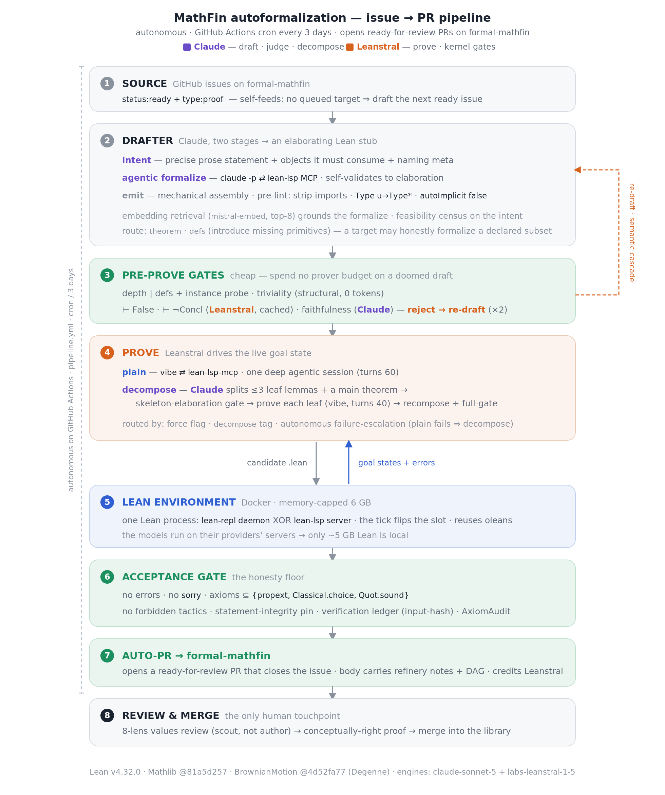

# MathFin autoformalization pipeline — architecture

An autonomous **issue → PR** pipeline: a GitHub Actions cron (every 2 days) picks a
`status:ready`+`type:proof` issue on **formal-mathfin**, drafts a faithful Lean stub,
proves it with **Leanstral**, gates it kernel-clean, and opens a ready-for-review PR
that closes the issue. Two engines carry it — **Claude** owns everything up to the
statement (intent · agentic formalize · faithfulness judge · decomposition),
**Leanstral** owns the Lean-side proving and the adversarial kernel gates. The only
human touchpoint is reviewing and merging the PR.

Pins: **Lean v4.32.0 · Mathlib @81a5d257 · BrownianMotion @4d52fa77 (Degenne)**
Engines: **claude-sonnet-5** (draft · judge · decompose) · **labs-leanstral-1-5**
(prove · kernel gates)

## The tick, end to end

1. **SOURCE** — GitHub issues on formal-mathfin (`status:ready` + `type:proof`). The
   queue self-feeds: with no unattempted target, the tick drafts one from the next
   ready issue. A cross-tick lesson carries the compressed post-mortem of an earlier
   failed attempt on the same issue into the new draft, so a retry is not blind.
2. **DRAFTER** — Claude, two stages, into an elaborating Lean stub: *intent*
   (precise prose + the objects it must consume + naming meta), then *agentic
   formalize* — one `claude -p` session wired to the same lean-lsp MCP the prover
   uses, writing the module against live diagnostics and self-validating to
   elaboration; *emit* assembles the module mechanically with a deterministic
   pre-lint (strip model imports · `Type u`→`Type*` · `open MeasureTheory` ·
   `autoImplicit false` · placement that cannot collide with an imported module) and
   a prose screen on drafted docstrings. Embedding retrieval (`mistral-embed`,
   top-8) grounds the formalize with pin-accurate premises; a feasibility census at
   intent time drops an intent that names MathFin primitives which do not exist.
   Route is `theorem` or `defs` (introduce missing primitives); a target may
   honestly formalize a declared subset.
3. **PRE-PROVE GATES** — the semantic battery on an elaborating draft,
   cheapest-first: depth (theorem route) or defs-consumption + instance probe (defs
   route) → triviality (structural, zero tokens) → hypothesis-rejection (⊢ False) →
   disproof (⊢ ¬Concl) → issue-faithfulness (Claude judge). The two kernel probes
   are Leanstral-driven and content-addressed, so a repeated goal costs no tokens
   and no Lean call across attempts and ticks. A rejection feeds its verdict back
   and **re-drafts** (semantic-repair cascade, ×2). The battery's diversity is the
   anti-Goodhart defense: a re-draft that games one gate still faces the others.
4. **PROVE** — Leanstral drives the live goal state. Two paths: **plain**
   (`vibe ⇄ lean-lsp-mcp`, one deep agentic session, turns 60) and **decompose**
   (Claude splits the target into ≤3 leaf lemmas + a main theorem → a
   skeleton-elaboration gate → prove each leaf as an ordinary single-sorry target,
   turns 40 → recompose + full-gate). Decompose is routed by a force flag, a
   `decompose` tag, or **autonomous failure-escalation** (plain can't close it ⇒
   escalate the same target to decompose).
5. **LEAN ENVIRONMENT** — Docker, memory-capped 6 GB, one Lean process at a time
   (`lean-repl daemon` XOR `lean-lsp server`), reusing the prebuilt oleans. The tick
   flips that single slot to lean-lsp around the agentic drafter and the prover, and
   back to the daemon for the gates. The models run on their providers' servers, so
   only the ~5 GB Lean env is local.
6. **ACCEPTANCE GATE** — the honesty floor: no errors, no `sorry`, axioms ⊆
   `{propext, Classical.choice, Quot.sound}`, no forbidden tactics, the
   statement-integrity pin (the accepted proof must still assert the *drafted*
   statement — no weakened conclusion, no dropped binder), verification ledger
   (input-hash freshness), AxiomAudit (build-enforced). Post-proof polish — golf,
   unused-hypothesis strengthening, import trim — is re-gated before it counts.
7. **AUTO-PR** — on a pass, open a ready-for-review PR on formal-mathfin that closes
   the source issue; the body carries the refinery notes (and the DAG, for a
   decompose proof) and credits Leanstral.
8. **REVIEW & MERGE** — the only human touchpoint: an 8-lens values review (the
   machine proof is a scout, not the author) refines it to the conceptually-right
   proof, then merges into the library.

## Same thing as Mermaid (renders on GitHub)

```mermaid
flowchart TD
  I["① SOURCE — GitHub issues (formal-mathfin)<br/>status:ready + type:proof · self-feeds the queue · cross-tick lessons"]
  D["② DRAFTER — Claude, two stages<br/>intent · prose + objects + naming meta<br/>agentic formalize · claude -p ⇄ lean-lsp MCP, self-validating to elaboration<br/>emit · assemble + pre-lint (strip imports · Type u→Type* · autoImplicit false)<br/>embedding retrieval (mistral-embed, top-8) grounds the formalize"]
  G["③ PRE-PROVE GATES — cheapest-first<br/>depth (theorem) | defs + instance probe (defs) → triviality<br/>→ ⊢ False (kernel) → ⊢ ¬Concl (kernel) → issue-faithfulness (Claude judge)<br/>kernel probes content-addressed: a repeated goal is free"]
  P["④ PROVE — Leanstral drives the goal state<br/>plain · vibe ⇄ lean-lsp-mcp (turns 60)<br/>decompose · Claude splits ≤3 leaves + main → skeleton gate → prove leaves (turns 40) → recompose<br/>routed by: force flag · decompose tag · autonomous failure-escalation"]
  E["⑤ LEAN ENVIRONMENT — Docker, mem-capped 6 GB<br/>one Lean process: lean-repl daemon XOR lean-lsp server · reuses oleans"]
  A["⑥ ACCEPTANCE GATE — honesty floor<br/>no errors · no sorry · axioms ⊆ standard 3 · no forbidden tactics<br/>statement-integrity pin · ledger · AxiomAudit · polish re-gated"]
  PR["⑦ AUTO-PR → formal-mathfin<br/>ready-for-review PR closes the issue · refinery notes + DAG · credits Leanstral"]
  H["⑧ REVIEW & MERGE — the only human touchpoint<br/>8-lens values review → conceptually-right proof → merge"]

  I --> D --> G --> P
  G -. "reject → re-draft (semantic cascade ×2)" .-> D
  P -->|candidate .lean| E
  E -->|goal states + errors| P
  E --> A --> PR --> H
```

