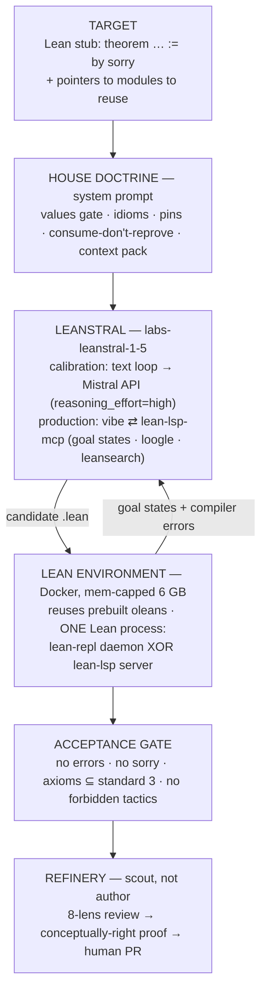

# Leanstral formalization harness — architecture

`labs-leanstral-1-5` proving theorems in a Mathlib + BrownianMotion quant-finance
Lean 4 library, with live goal-state feedback over MCP and an axiom-clean gate.

Pins: **Lean v4.31.0 · Mathlib @fabf563a · BrownianMotion @bdf5ea0c (Degenne)**

```
┌────────────────────────────────────────────────────────────────┐
│ TARGET                                                          │
│   a Lean 4 stub:  theorem … := by sorry                        │
│   + pointers to the existing modules it should build on        │
└───────────────────────────────┬────────────────────────────────┘
                                ▼
┌────────────────────────────────────────────────────────────────┐
│ HOUSE DOCTRINE   (system prompt, injected on every attempt)    │
│   values gate · house idioms · pins ·                          │
│   consume-don't-reprove · per-target context pack              │
└───────────────────────────────┬────────────────────────────────┘
                                ▼
┌────────────────────────────────────────────────────────────────┐
│ LEANSTRAL   (labs-leanstral-1-5)                               │
│   two harnesses, one doctrine:                                 │
│   • calibration : text loop → Mistral API                      │
│                   (reasoning_effort=high, token budget)        │
│   • production  : vibe ⇄ lean-lsp-mcp        (trained-for)     │
│                   live lean_goal / hover / diagnostics /       │
│                   loogle / leansearch                          │
└──────────────┬─────────────────────────────────▲───────────────┘
              │ candidate .lean                  │ goal states +
              ▼                                  │ compiler errors
┌────────────────────────────────────────────────────────────────┐
│ LEAN ENVIRONMENT   (Docker, mem-capped 6 GB)                   │
│   reuses the prebuilt oleans · ONE Lean process at a time:     │
│   lean-repl daemon   XOR   lean-lsp server                     │
│   (model runs on Mistral's servers → only ~5 GB Lean is local) │
└───────────────────────────────┬────────────────────────────────┘
                                ▼
┌────────────────────────────────────────────────────────────────┐
│ ACCEPTANCE GATE                                                │
│   no errors · no sorry ·                                       │
│   axioms ⊆ {propext, Classical.choice, Quot.sound} ·           │
│   no forbidden tactics (native_decide, exact?, apply?, …)      │
└───────────────────────────────┬────────────────────────────────┘
                                ▼
┌────────────────────────────────────────────────────────────────┐
│ REFINERY   (scout, not author)                                 │
│   8-lens values review → conceptually-right proof →            │
│   a human authors the PR into the library                      │
└────────────────────────────────────────────────────────────────┘
```

## Same thing as Mermaid (renders on GitHub)


